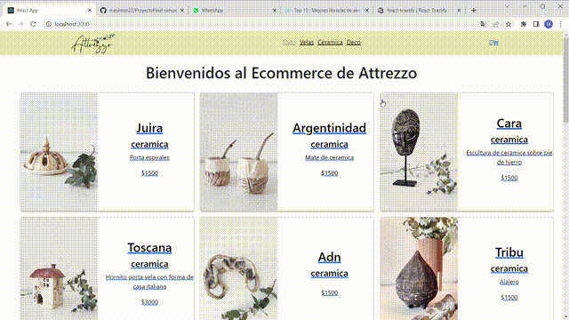

Attrezzo es un Ecommerce que vende productos artesanales, en 3 categorias:
- Velas aromaticas de soja, en distintos tipos de recipientes,
- piezas hechas en ceramica,
- Objetos decorativos con mezcla de materiales.

En el proyecto se cumple con los requerimientos de la rubrica, logrando una navegabilidad entre los distintos componentes haciendo el proceso de compra.

Frameworks utilizados:
- Bootstrap icons (para traer el icono del carrito),
- Sweetalert (para crear una alerta animada al enviar la orden de compra, y para mostrar un maximo de stock disponible)
- Toastify (para dar una notificacion que sea mas amigable cuando agregamos un producto al carrito)

